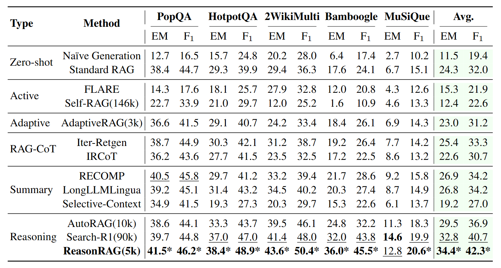

<h1 align="center">ReasonRAG: Enhancing Agentic RAG with Process-Supervised Reinforcement Learning</h1>

# Overview
Recent advancements in outcome-supervised Reinforcement Learning (RL), exemplified by OpenAI's O1 and DeepMind's R1, have demonstrated remarkable improvements in language model (LLM) reasoning capabilities. Integrating outcome-supervised RL with search engines presents another promising avenue for boosting LLM reasoning. However, outcome-supervised RL often grapples with challenges such as sparse reward, training instability, and inefficient exploration.

To address these limitations, process-supervised RL emerges as a compelling solution for enhancing Agentic RAG, offering the advantage of fine-grained rewards. We introduce ReasonRAG, a process-supervised method designed to refine Agentic RAG's strategic preferences.

Our approach consists of three key steps:

1. We leverage Monte Carlo Tree Search (MCTS) to generate process-supervised rollouts, yielding rich data on process-level strategic preferences.
2. We then employ Direct Preference Optimization (DPO) to effectively optimize these strategic preferences within the Agentic RAG framework.
3. Finally, we construct an Agentic RAG pipeline that enables the LLM to autonomously generate queries, extract evidence, and formulate answers.
We provide the dataset we constructed and links to our trained models below.

* **RAG_ProGuide Dataset:** [https://huggingface.co/datasets/reasonrag/RAG_ProGuide](https://huggingface.co/datasets/reasonrag/RAG_ProGuide)
* **Trained Models:** [Qwen2.5-7B-Instruct-ReasonRAG](https://huggingface.co/reasonrag/Qwen2.5-7B-Instruct-ReasonRAG)
* **Trained Lora Models:** [Qwen2.5-7B-Instruct-RAG-Lora](https://huggingface.co/reasonrag/Qwen2.5-7B-Instruct-RAG-Lora)

ReasonRAG achieves superior performance on five benchmark datasets using only 5k training instances, significantly fewer than the 90k training instances required by Search-R1.



# Method
We employ process-supervised RL to enhance Agentic RAG capabilities:
1. Generate process-supervised reward data.
2. Policy Preference Optimization
3. Agentic RAG Inference

# Data
We randomly data from PopQA, HotpotQA, 2WikimultihopQA to generate process-supervised preference data. Then, we use GPT-4o as the policy model to generate rollout data. The generated process-supervised data, namely RAG-ProGuide is available at: [https://huggingface.co/datasets/reasonrag/RAG_ProGuide](https://huggingface.co/datasets/reasonrag/RAG_ProGuide)

# Quick Start
## Environment Settings
Construct [FlashRAG](https://github.com/RUC-NLPIR/FlashRAG) environments:
```bash
conda create --name reasonrag python=3.10.16
conda activate reasonrag
pip install flashrag-dev --pre
pip install flashrag-dev[full]
pip install vllm>=0.4.1
pip install deepspeed
```

## Data Preparation

Download wikidump as the corpus for retrieval

```bash
# Download wikidump
wget https://archive.org/download/enwiki-20181220/enwiki-20181220-pages-articles.xml.bz2

# Build index
python -m flashrag.retriever.index_builder \
  --retrieval_method bge \
  --model_path /BAAI/bge-base-en-v1.5 \
  --corpus_path indexes/wiki18.jsonl \
  --save_dir indexes/ \
  --use_fp16 \
  --max_length 512 \
  --batch_size 256 \
  --pooling_method mean \
  --faiss_type Flat 
```

Download QA dataset from huggingface [RUC-NLPIR/FlashRAG_datasets](https://huggingface.co/datasets/RUC-NLPIR/FlashRAG_datasets)

## Data Generation
```bash
python data_generation.py --dataset_name popqa --model gpt-4o
python data_generation.py --dataset_name hotpotqa --model gpt-4o
python data_generation.py --dataset_name 2wikimultihopqa --model gpt-4o
python preference_data_generation.py 
```

## Training
```bash
# Install LLaMA Factory
git clone --depth 1 https://github.com/hiyouga/LLaMA-Factory.git
cd LLaMA-Factory
pip install -e ".[torch,metrics]"

# Set the dataset path before prefrence optimization
llamafactory-cli train training_config/qwen_dpo.yaml
```

## Inference
```bash
python inference.py --dataset_name hotpotqa --model $MODEL_NAME
```
